# Copy Flow System Architecture

## 1. Executive Summary

The **Copy Flow System** is a platform facilitating a network of self-service printing kiosks. The overarching architecture splits responsibility between real-time hardware interaction (IoT printing nodes), conversational chatbot interfaces (WhatsApp & Telegram), and a robust administrative control plane.

The **AdminPortal (Backend)** acts as the central orchestrator for these operations, utilizing a modular, layered structure to separate concerns and ensure maintainability.

## 2. System Architecture Diagram

## 3. High-Level Architecture & Technology Stack

### Backend Control Plane
- **Core Framework:** NestJS (Node.js) using modular architecture for bounded contexts.
- **Database:** PostgreSQL for persistent record storage.
- **ORM:** Prisma Client for type-safe database access and migrations.
- **Messaging/Chatbots:** Integrated abstractions for Meta, Twilio, and Telegram.
- **Payments:** External payment provider integration (Razorpay).
- **Authentication:** Passport.js with JWT strategies for securing the admin API.

### Kiosk Node Architecture (Hardware)
- **Nodes:** Physical kiosks (e.g., Raspberry Pi-based) communicating with the backend.
- **State Polling:** Real-time metrics emitted via HTTP long-polling/heartbeats tracking status (`HIGH`, `LOW`, `EMPTY` paper levels).

### Administrator Interface
- **Dashboard:** Separate Next.js application leveraging the APIs exposed by the NestJS backend to provide an operational overview.

## 4. Database Schema Mapping (ERD Overview)

The PostgreSQL database acts as the single source of truth, heavily relying on relational links:

* **Kiosk:** Represents physical printing hardware. Stores authentication `secret`, `location`, `paper_level`, and a `last_heartbeat` timestamp crucial for determining offline states.
* **PrintJob:** The core entity linking a user's print request to a specific kiosk. Includes `page_count`, `color_mode` (BW/COLOR), financial data (`payable_amount`), and lifecycle `JobStatus` (UPLOADED -> PAID -> PRINTED -> FAILED).
* **Payment:** Represents the lifecycle of external payment integrations (Razorpay). Tied strictly 1-to-1 to a `PrintJob`.
* **PrintToken:** Security token mapping generated post-payment. Utilized by the hardware kiosks to authorize secure document release via `token_hash`.
* **User & AuditLog:** `User` handles identity of Admins. `AuditLog` stores an immutable historic trail of system events, including dynamic pricing changes and hardware resets.
* **PricingConfig:** Stores the current operational pricing parameters (`bw_price`, `color_price`). Defines dynamically computed payload values for the chatbot engine.

## 5. Logical Module Architecture

The NestJS backend scales horizontally through carefully bounded functional modules:

### `WhatsappModule` (Conversational Engine)
This module runs the conversational flow. It processes user payloads via webhooks.
- **Providers System:** Encapsulates chatbot network functionality using an abstract interface. Implemented concrete strategies for `Twilio`, `Meta`, and recently `Telegram`.
- **Queuing:** Utilizes an asynchronous `whatsapp.queue.ts` implementation to decouple HTTP requests from computationally heavy interactions (like parsing documents or sending media callbacks).

### `PaymentModule` (Transaction Pipeline)
Manages the integration with the Razorpay API.
- Generates payment links triggered mid-conversation.
- Recieves asymmetric webhook signatures from Razorpay to fulfill the `PAID` state transition over `PrintJob`s.
- Notifies the PrintModule or Chatbot to push completion messaging.

### `PrintModule`
Facilitates hardware communication and controls document access.
- Validates token claims from physical kiosk API attempts.
- Injects print parameters over to the respective IoT hardware and handles "printed successfully" callbacks.

### `StorageModule`
Handles intermediate or long-term file retention securely. Likely involves securely buffering incoming PDF/Images from chatbot webhook payloads before they are pulled by kiosks. Can integrate seamlessly to AWS S3 or Local Disk storage depending on the provider implementation.

### `AdminModule` & `JobsModule` 
Administrative bounded contexts serving the Next.js frontend. They emit metrics, expose audit reports, modify `PricingConfig`, and force hardware interactions (e.g., simulating remote kiosk refills).

## 6. Typical Operation Flows

### Flow A: Chatbot Printing & Payment
1. **Upload:** User sends a document to the chatbot (e.g., Twilio / Meta / Telegram).
2. **Analysis:** The `WhatsappModule` queues the payload, the `StorageModule` caches the file, and page counts/color preferences are identified.
3. **Estimation:** System checks `PricingConfig` to calculate cost. `WhatsappModule` responds via provider quoting the cost.
4. **Checkout:** User confirms. `PaymentModule` triggers internal state (`UPLOADED`) and provides a Razorpay short-link.
5. **Fulfillment:** User pays. Razorpay webhook fires updating `Payment`. `PrintToken` generates. Chatbot pings user the Secure Passcode.

### Flow B: Hardware Retrieval
1. **Interaction:** User approaches a Kiosk, provides the `PrintToken` passcode.
2. **Verification:** Kiosk calls `PrintModule` API validating the token hash.
3. **Execution:** File is safely delivered over to Kiosk bounds, Job status is marked `PRINTED`.
4. **Hardware Sync:** Kiosk parallelly sends `last_heartbeat` containing its resulting printer paper levels back to the backend.

### Flow C: Admin Monitoring
1. **Access:** Admin authenticates reaching the Next.js Dashboard.
2. **Dashboard Query:** Frontend hits `AdminModule` API mapping metrics across all kiosks.
3. **Alerts:** Backend checks the `interval` elapsed from `last_heartbeat` and `paper_level` enum string warning administrators if human operators must dispatch for maintenance.

## 7. Security & Infrastructure Summary
- **JWT Authentication:** Stateful user session representation via `Passport.js` limits API capabilities based on predefined Roles.
- **Webhook Verification:** Cryptographic HMAC signature guarantees block imitation of Razorpay status updates or Twilio messages.
- **Hardware Secrets:** Kiosks authenticate themselves symmetrically using isolated environment variables (`pi_id` and `secret`) rather than exposing raw API capability to public networks.
